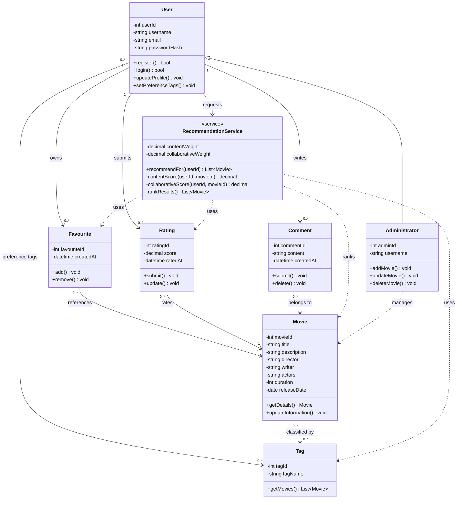
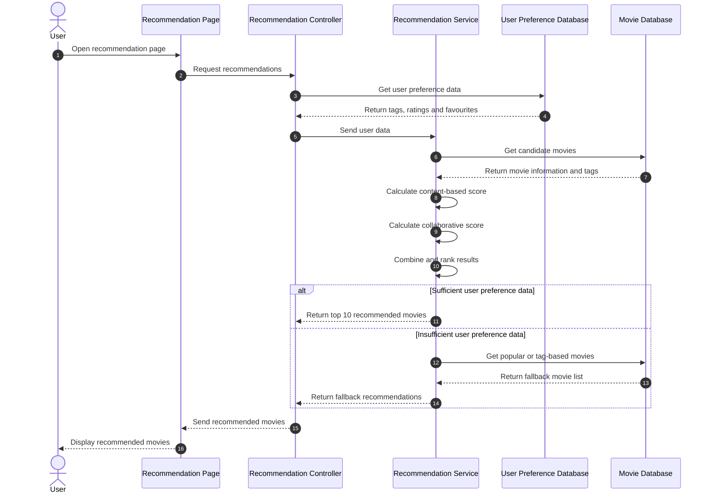

# Movie Recommendation System UML Diagrams

## 1. Class Diagram

```mermaid
classDiagram
    class User {
        -int userId
        -string username
        -string email
        -string passwordHash
        +register() bool
        +login() bool
        +updateProfile() void
        +setPreferenceTags() void
    }

    class Administrator {
        -int adminId
        -string username
        +addMovie() void
        +updateMovie() void
        +deleteMovie() void
    }

    class Movie {
        -int movieId
        -string title
        -string description
        -string director
        -string writer
        -string actors
        -int duration
        -date releaseDate
        +getDetails() Movie
        +updateInformation() void
    }

    class Tag {
        -int tagId
        -string tagName
        +getMovies() List~Movie~
    }

    class Favourite {
        -int favouriteId
        -datetime createdAt
        +add() void
        +remove() void
    }

    class Rating {
        -int ratingId
        -decimal score
        -datetime ratedAt
        +submit() void
        +update() void
    }

    class Comment {
        -int commentId
        -string content
        -datetime createdAt
        +submit() void
        +delete() void
    }

    class RecommendationService {
        <<service>>
        -decimal contentWeight
        -decimal collaborativeWeight
        +recommendFor(userId) List~Movie~
        -contentScore(userId, movieId) decimal
        -collaborativeScore(userId, movieId) decimal
        -rankResults() List~Movie~
    }

    User <|-- Administrator

    User "1" --> "0..*" Favourite : owns
    Favourite "0..*" --> "1" Movie : references

    User "1" --> "0..*" Rating : submits
    Rating "0..*" --> "1" Movie : rates

    User "1" --> "0..*" Comment : writes
    Comment "0..*" --> "1" Movie : belongs to

    User "0..*" --> "0..*" Tag : preference tags
    Movie "0..*" --> "0..*" Tag : classified by

    User ..> RecommendationService : requests
    RecommendationService ..> Movie : ranks
    RecommendationService ..> Rating : uses
    RecommendationService ..> Favourite : uses
    RecommendationService ..> Tag : uses
    Administrator ..> Movie : manages
```

## 2. Automatic Movie Recommendation Sequence Diagram

```mermaid
sequenceDiagram
    autonumber

    actor User
    participant Page as Recommendation Page
    participant Controller as Recommendation Controller
    participant Service as Recommendation Service
    participant PreferenceDB as User Preference Database
    participant MovieDB as Movie Database

    User->>Page: Open recommendation page
    Page->>Controller: Request recommendations
    Controller->>PreferenceDB: Get user preference data
    PreferenceDB-->>Controller: Return tags, ratings and favourites
    Controller->>Service: Send user data
    Service->>MovieDB: Get candidate movies
    MovieDB-->>Service: Return movie information and tags

    Service->>Service: Calculate content-based score
    Service->>Service: Calculate collaborative score
    Service->>Service: Combine and rank results

    alt Sufficient user preference data
        Service-->>Controller: Return top 10 recommended movies
    else Insufficient user preference data
        Service->>MovieDB: Get popular or tag-based movies
        MovieDB-->>Service: Return fallback movie list
        Service-->>Controller: Return fallback recommendations
    end

    Controller-->>Page: Send recommended movies
    Page-->>User: Display recommended movies
```
